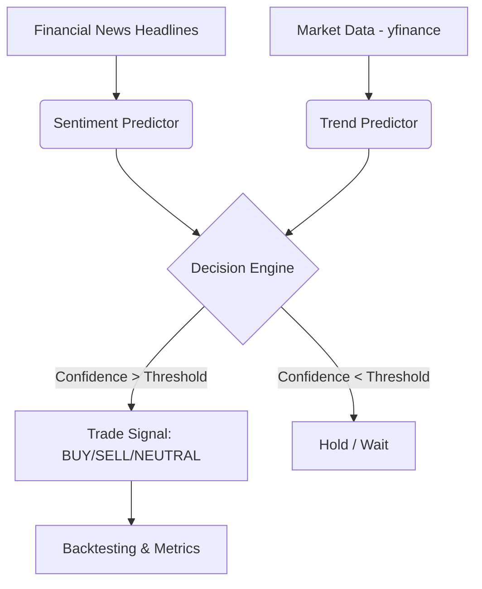

# 📈 Stock Sentiment & Trend Predictor

[](https://www.python.org/)
[](https://opensource.org/licenses/MIT)

A unified pipeline for predicting banking-stock price movements by fusing **Sentiment Analysis** (from financial news) and **Trend Prediction** (from historical market data).

## 🚀 Overview

This project aims to provide a robust prediction tool for Indian banking stocks (HDFCBANK, SBIN, ICICIBANK, AXISBANK, KOTAKBANK). It combines two distinct models:
1.  **Sentiment Predictor**: Analyzes news headlines using NLP (VADER & FinBERT) to assess market sentiment.
2.  **Trend Predictor**: Uses time-series models (LSTM, CNN, GNN, Transformers) to capture price momentum and technical patterns.

The final decision is a weighted fusion of both signals, providing high-confidence trade signals or moderate fallback logic.

---

## 🏗️ Architecture



---

## ✨ Key Features

- **Multi-Model Fusion**: Leverages both textual sentiment and numerical price trends.
- **Pre-trained Weights Included**: "Fork and run" ready—models are pre-trained and included in the repository.
- **Comprehensive Backtesting**: Evaluate performance with capital allocation, position sizing, and PnL tracking.
- **Live-Ready Pipeline**: Easily query predictions for fresh news and current dates.
- **Deep NLP**: Utilizes FinBERT for context-aware financial sentiment analysis.

---

## 🛠️ Installation

1.  **Clone the Repository**:
    ```bash
    git clone https://github.com/YOUR_USERNAME/Stock-Predictor.git
    cd Stock-Predictor
    ```

2.  **Set up Virtual Environment**:
    ```powershell
    python -m venv .StoEnv
    .\.StoEnv\Scripts\Activate.ps1
    ```

3.  **Install Dependencies**:
    ```bash
    pip install -r requirements.txt
    ```

---

## 📊 Usage

### 1. Single Prediction
Run a combined prediction for a specific headline and stock:

```bash
python -c "from combined_prediction_pipeline import CombinedPredictionPipeline; p=CombinedPredictionPipeline(); print(p.predict('HDFC Bank Q3 profit rises','2026-03-11','HDFCBANK',verbose=True))"
```

### 2. Backtesting
Run the backtesting suite to see how the strategy performs over historical data:

```bash
python combined_backtesting.py --samples 30 --threshold 0.45 --initial-capital 100000
```

**Main Arguments:**
- `--samples`: Number of random news rows to test.
- `--threshold`: Confidence threshold (0.0 to 1.0) to trigger a trade.
- `--initial-capital`: Starting cash balance.
- `--position-size`: Fraction of cash per trade (e.g., 0.2).

### 3. Data Extraction
To scrape fresh news or align data, use the scripts in `data_extraction/`:
```bash
python data_extraction/content_extractor.py
```

---

## 📁 Repository Structure

```text
Stock-Predictor/
├── combined_prediction_pipeline.py  # Main entry point for inference
├── combined_backtesting.py          # Trading strategy & backtesting engine
├── sentiment-predictor/             # NLP models & pipelines
│   └── saved_models/                # Pre-trained sentiment weights
├── trend-predictor/                 # Time-series models (LSTM, GNN, etc.)
│   └── saved_model/                 # Pre-trained trend weights
├── data_extraction/                 # Scrapers and data alignment scripts
├── data/                            # Folder structure for raw/processed data
├── requirements.txt                 # Project dependencies
└── README.md                        # Documentation
```

---

## 📝 Notes on Data

- **Processed Data**: Large CSV files (like `features.csv`) are excluded from the repository to keep it lightweight. You can generate them by running the notebooks in `sentiment-predictor/` and `trend-predictor/`.
- **API Keys**: This project uses public APIs (like `yfinance`) and does not require private API keys for standard prediction.

---

## 🤝 Contributing

Contributions are welcome! Please feel free to submit a Pull Request.

## 📄 License

This project is licensed under the MIT License - see the LICENSE file for details.
